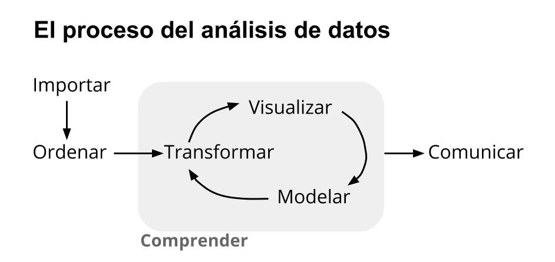

# Repasando: Capítulo 1 ¿Qué es la ciencia de datos?

vimos de que se trataba la ciencia de datos, 
y algo que quiero que recuerden para hoy, EL PROCESO: 

---

# Repasando: Capítulo 2 Una presentación a toda marcha de R

Vimos de que iba la cosa, y arrancamos con una demostracion que funcionaba todo ok,
un rico postre para arrancar incentivados :D ! 

---

# Ahora SI ! Capítulo 3 Poniendo los datos en forma !

Al arrancar un proyecto de datos ... seguramente alguna vez y sino prueben buscando algunos datos ... nuevos ... 

lo primero que nos toca es EXAMINAR ! ( familiarizarnos, entender ...  ) " data understanding "

como ? veamos ...

???

cortesia de:  [busqueda aleatoria en google images :D ](https://www.companycartoday.co.uk/managing-data/)

mencionar que nod dijeron " Nos interesa revisar los datos de llamadas de call center, pero todavia no saben que hay si podemos revisar y contarles "

---

# Explorar ! 

primero nos conviene ver los datos aunque sea un poquito ... 

- [ 1 ] poder levantarlos ( puedo acceder, conectarme ?) 
- [ 2 ] poder verlos  ( los leo ? veo que hay ? )
- [ 3 ] poder entender un poco mas ... ( que columnas hay ? de que tipos ? que rangos manejan ? )
- [ 4 ] averiguar si existen validaciones ... y si se cumplen ... ( fecha de primer trabajo antes de fecha de nacer ?? )

???

ir al capitulo_3_codigo  y fijarse 

-- # Exploracion 1 ( poder levantarlos ) y repasar los 4 puntos ... 

y mencionar que vamos a reportar, cuando le contamos nos hacen  hacen otra pregunta que los datos no alcanzan

---

# TOCA investigar / pedir ayuda .... 

Por suerte un conocido nos tiro una mano y nos comento que hay un conjunto de datos donde tenemos el cruce de 
barrio / comuna , veamos que trae ... 

???

ir al capitulo_3_codigo  y fijarse 

-- TOCA investigar / pedir ayuda ....  Revisemos los datos que nos sugirieron

---

# GOL! , recordar agradecer / dar credito a quienes ayudan :D 

sin embargo .... si tan solo pudiera juntarlo .... 

???

cortesia de:  [busqueda aleatoria de gol en duckduckgo :D  ](https://duckduckgo.com/?q=gol+futbol&t=lm&iar=images&iax=images&ia=images)

--- 

# TOCA CRUZAR ! la operacion JOIN ! ( juntar :p )

Como lo juntamos ? con JOIN! ( juntar )

buen existe un universo de joins ... depende que querramos hacer como vamos a cruzar ... 
pero por el momento dejemoslo en que el que tenemos sirve :D

si queremos expandir, TENEMOS MACHETE :D !

[data wrangling cheatsheet :D  ]( https://www.rstudio.com/wp-content/uploads/2015/02/data-wrangling-cheatsheet.pdf)

Para nuestro proposito LOGRAMOS TENER LA COLUMNA !!!! Toca contestar la pregunta ! 

CUANTOS RECLAMOS DE ACERA ESTAN EN LOS BARRIOS DE LA COMUNA 15 ?

ufff me parece que vamos a tener que hacer algunas cosas mas ... 

---

# ESPERA ! antes de seguir como locos, GRABEMOS ! una tarea SUPER IMPORTANTE ! 

si te olvidas de grabar, y se te acabo la bateria de la notebook ... perdiste toooooooodo, tenes que ejecutar todo devuelta D: ! 

siempre que grabemos , verifiquemos, no queermos tener que enterarnos cuando ya cerramos todo :P !

como contarlo de forma manual puede ser un poco trabajoso ... me parece que vamos a tener que hacer algunas cosas mas ... 

---

# Transformando los datos

vamos a acomodar los datos para poder contestar la pregunta ... como ? con algunas nuevas funciones 

- select()
- filter()
- arrange()
- mutate()
- summarise()

???

ir al capitulo_3_codigo a explicar cada uno

---

# CUANTOS RECLAMOS DE ACERA ESTAN EN LOS BARRIOS DE LA COMUNA 15 ?

Como harian ?

???

ir al capitulo_3_codigo a como lo harian con los metodos y de yapa el pipe.

luego invitar a hacer los ejercicio.

---

class: center, middle

# GRACIAS ! 

Ahora toca ejercitar ! 

Nos vemos en el capitulo siguiente ! 

